# 📊 Diagrama da Solução Completa

> Sistema de Previsão de Preços de Ações com LSTM - Tech Challenge Fase 4

---

## 🎯 Arquitetura Geral do Sistema

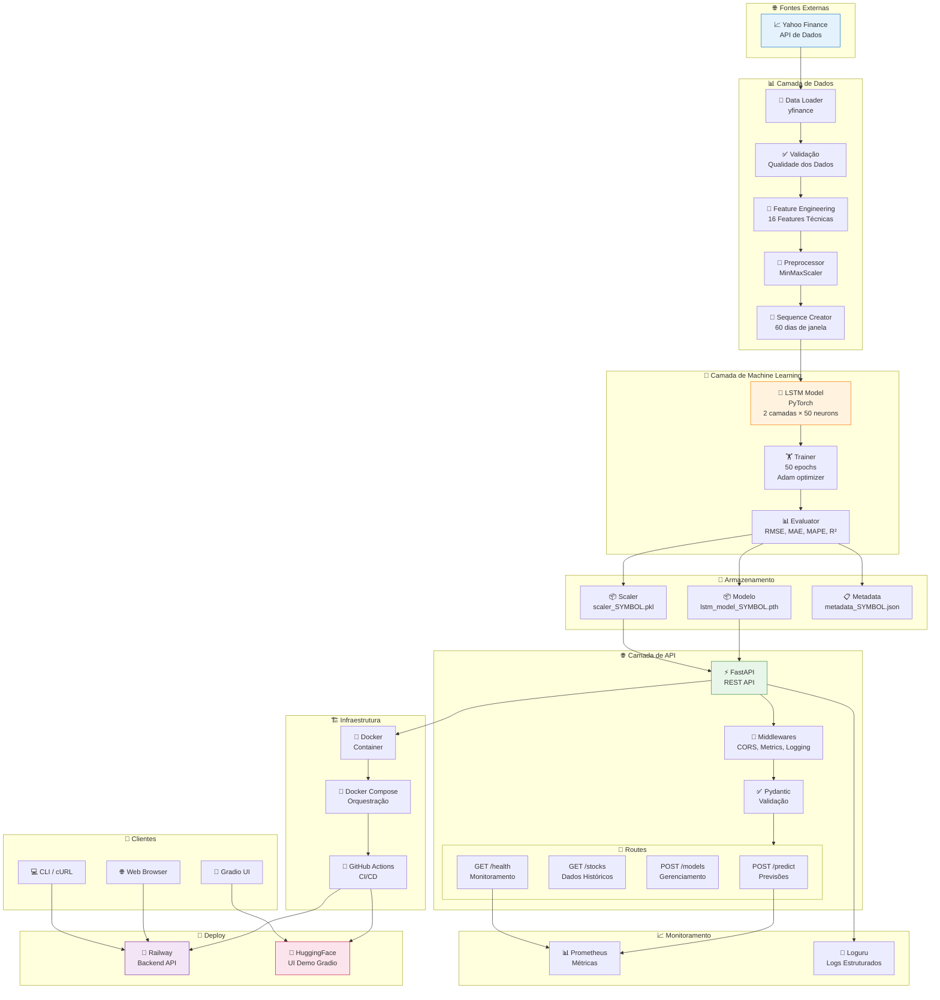

---

## 🔄 Fluxo de Treinamento Detalhado

```mermaid
flowchart LR
    subgraph INPUT["📥 Entrada"]
        CMD["python train_model.py AAPL"]
    end

    subgraph COLLECT["1️⃣ Coleta"]
        YAHOO["Yahoo Finance"]
        RAW["Dados OHLCV<br/>1756 registros"]
    end

    subgraph PROCESS["2️⃣ Processamento"]
        FEAT["Feature Engineering"]
        FEATURES["16 Features:<br/>• Preços (5)<br/>• Variações (4)<br/>• MAs (3)<br/>• Volatilidade (2)<br/>• Momentum (2)"]
        NORM["Normalização<br/>MinMaxScaler<br/>Range: 0-1"]
    end

    subgraph SEQUENCE["3️⃣ Sequências"]
        SEQ["Criar Janelas<br/>60 dias cada"]
        SPLIT["Split<br/>80% Train<br/>10% Val<br/>10% Test"]
    end

    subgraph TRAIN["4️⃣ Treinamento"]
        INIT["Inicializar LSTM<br/>input: 16<br/>hidden: 50<br/>layers: 2"]
        LOOP["Training Loop<br/>50 epochs"]
        OPT["Adam Optimizer<br/>LR: 0.001"]
    end

    subgraph EVAL["5️⃣ Avaliação"]
        METRICS["Calcular Métricas:<br/>• RMSE: 3.45<br/>• MAE: 2.67<br/>• MAPE: 1.89%<br/>• R²: 0.9567<br/>• Dir Acc: 76.47%"]
    end

    subgraph SAVE["6️⃣ Salvamento"]
        MODEL["lstm_model_AAPL.pth"]
        SCALER["scaler_AAPL.pkl"]
        META["metadata_AAPL.json"]
    end

    subgraph OUTPUT["📤 Saída"]
        DONE["✅ Modelo Pronto!"]
    end

    CMD --> YAHOO
    YAHOO --> RAW
    RAW --> FEAT
    FEAT --> FEATURES
    FEATURES --> NORM
    NORM --> SEQ
    SEQ --> SPLIT
    SPLIT --> INIT
    INIT --> LOOP
    LOOP --> OPT
    OPT --> METRICS
    METRICS --> MODEL
    METRICS --> SCALER
    METRICS --> META
    MODEL --> DONE
    SCALER --> DONE
    META --> DONE

    style CMD fill:#e8f5e9
    style LSTM fill:#fff3e0
    style METRICS fill:#e3f2fd
    style DONE fill:#c8e6c9
```

---

## 🔮 Fluxo de Predição

```mermaid
flowchart LR
    subgraph REQUEST["📥 Request"]
        REQ["POST /api/v1/predict<br/>{symbol: AAPL, days_ahead: 1}"]
    end

    subgraph VALIDATE["1️⃣ Validação"]
        PYDANTIC["Pydantic<br/>Validar Schema"]
        CHECK["Verificar<br/>Modelo Existe"]
    end

    subgraph LOAD["2️⃣ Carregar"]
        LOAD_MODEL["Carregar<br/>lstm_model_AAPL.pth"]
        LOAD_SCALER["Carregar<br/>scaler_AAPL.pkl"]
    end

    subgraph DATA["3️⃣ Dados"]
        YAHOO["Yahoo Finance<br/>Últimos 60 dias"]
        PROCESS["Criar Features<br/>Normalizar"]
    end

    subgraph PREDICT["4️⃣ Predição"]
        LSTM["LSTM Forward Pass<br/>Input: [1, 60, 16]"]
        INVERSE["Inverse Transform<br/>Desnormalizar"]
    end

    subgraph RESPONSE["📤 Response"]
        RESP["{<br/>  predicted_price: 185.50<br/>  current_price: 183.20<br/>  change_pct: 1.25%<br/>  prediction_date: 2024-12-03<br/>}"]
    end

    REQ --> PYDANTIC
    PYDANTIC --> CHECK
    CHECK --> LOAD_MODEL
    CHECK --> LOAD_SCALER
    LOAD_MODEL --> YAHOO
    LOAD_SCALER --> YAHOO
    YAHOO --> PROCESS
    PROCESS --> LSTM
    LSTM --> INVERSE
    INVERSE --> RESP

    style REQ fill:#e3f2fd
    style LSTM fill:#fff3e0
    style RESP fill:#e8f5e9
```

---

## 🧠 Arquitetura do Modelo LSTM

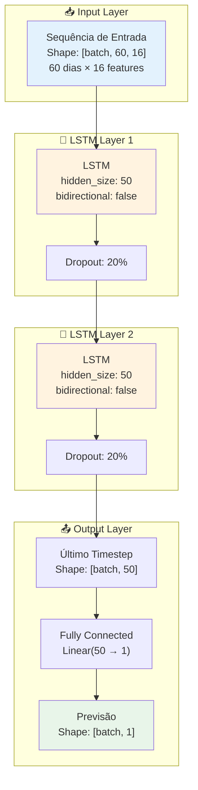

---

## 🎨 Features do Modelo

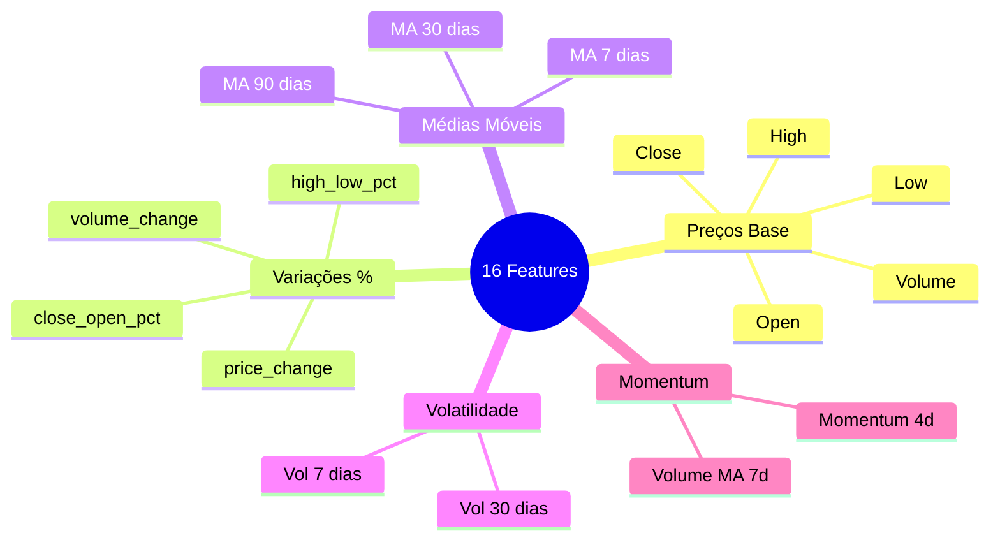

---

## 🌐 Arquitetura da API

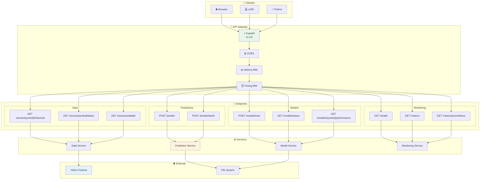

---

## 🚀 Pipeline de Deploy

```mermaid
flowchart LR
    subgraph DEV["💻 Development"]
        CODE["📝 Código"]
        TEST_LOCAL["🧪 Testes Locais"]
        COMMIT["📦 Git Commit"]
    end

    subgraph CICD["🔄 CI/CD"]
        PUSH["📤 Git Push"]
        GH_ACTIONS["⚙️ GitHub Actions"]
        
        subgraph PIPELINE["Pipeline"]
            LINT["🔍 Lint<br/>ruff"]
            FORMAT["📐 Format<br/>black"]
            TYPE["📝 Type Check<br/>mypy"]
            PYTEST["🧪 Tests<br/>pytest"]
            BUILD["🐳 Build Docker"]
        end
    end

    subgraph DEPLOY_TARGET["🚀 Deploy"]
        RAILWAY["🚂 Railway<br/>Backend API"]
        HF["🤗 HuggingFace<br/>Gradio UI"]
    end

    subgraph PROD["🌐 Production"]
        API_LIVE["⚡ API Live<br/>api.railway.app"]
        UI_LIVE["🎨 UI Live<br/>hf.co/spaces"]
        HEALTH["❤️ Health Checks"]
        LOGS["📝 Logs"]
        METRICS_PROD["📊 Metrics"]
    end

    CODE --> TEST_LOCAL
    TEST_LOCAL --> COMMIT
    COMMIT --> PUSH
    PUSH --> GH_ACTIONS
    GH_ACTIONS --> LINT
    LINT --> FORMAT
    FORMAT --> TYPE
    TYPE --> PYTEST
    PYTEST --> BUILD
    BUILD --> RAILWAY
    BUILD --> HF
    RAILWAY --> API_LIVE
    HF --> UI_LIVE
    API_LIVE --> HEALTH
    API_LIVE --> LOGS
    API_LIVE --> METRICS_PROD

    style CODE fill:#e3f2fd
    style GH_ACTIONS fill:#fff3e0
    style RAILWAY fill:#e8f5e9
    style HF fill:#fce4ec
```

---

## 📊 Métricas de Avaliação

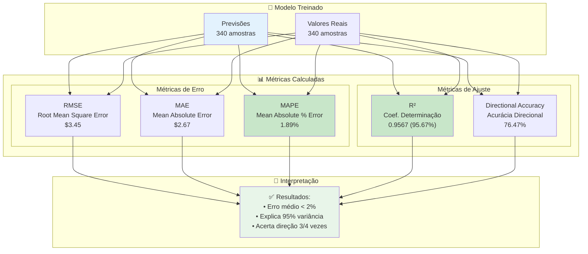

---

## 🗂️ Estrutura do Projeto

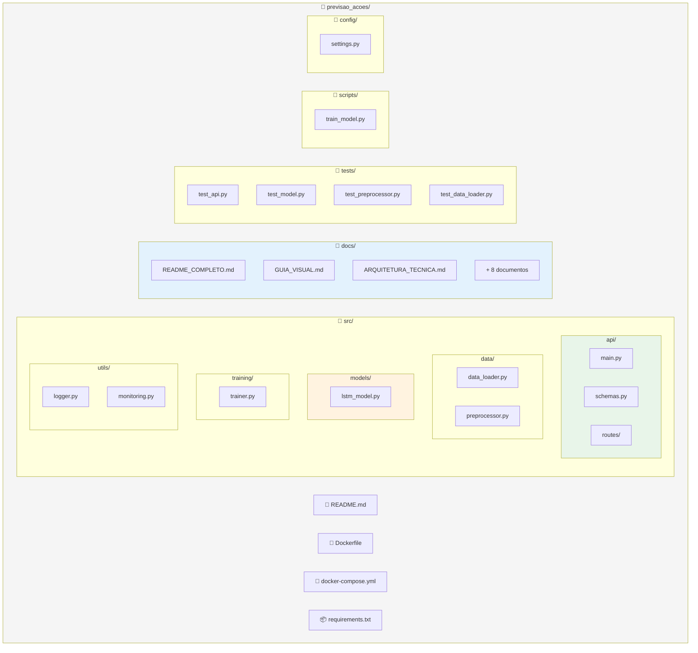

---

## 🔄 Ciclo de Vida do Modelo

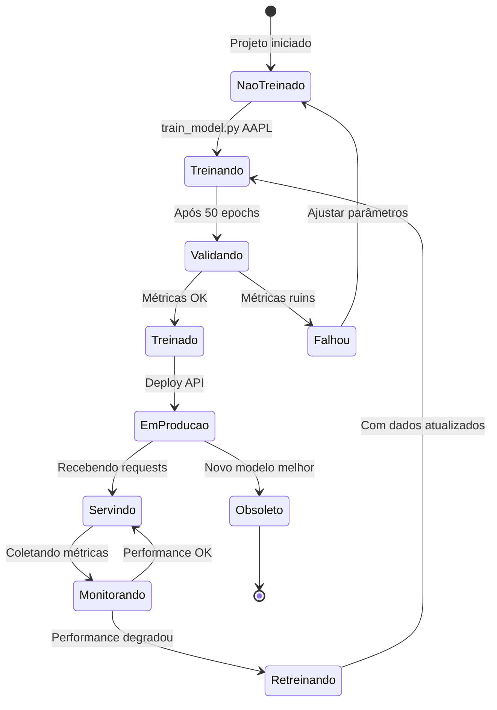

---

## 🎯 Resumo Visual da Solução

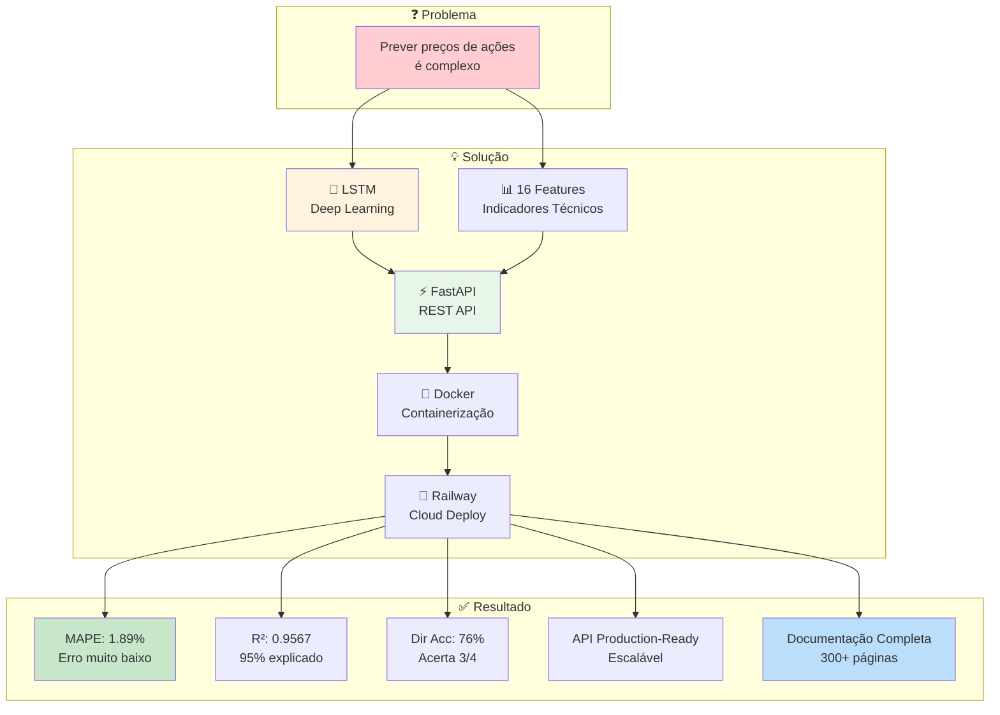

---

## 📋 Tech Stack Completa

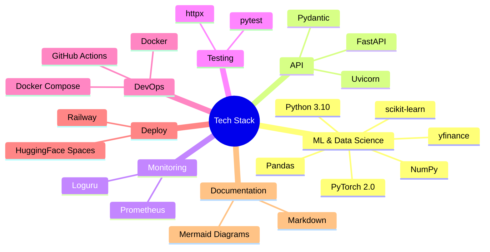

---

## 📌 Links Importantes

| Recurso | Descrição |
|---------|-----------|
| 📊 **Yahoo Finance** | Fonte de dados |
| ⚡ **FastAPI** | Framework API |
| 🔥 **PyTorch** | Deep Learning |
| 🐳 **Docker** | Containerização |
| 🚂 **Railway** | Cloud Deploy |
| 🤗 **HuggingFace** | UI Demo |

---

## ⚠️ Disclaimer

> **Este é um projeto educacional** desenvolvido para o Tech Challenge Fase 4 da FIAP.
> 
> **NÃO USE** para decisões reais de investimento. O mercado de ações é altamente volátil e imprevisível.

---

*Tech Challenge Fase 4 - FIAP Pós-Tech Machine Learning Engineering*

*Dezembro 2024*

